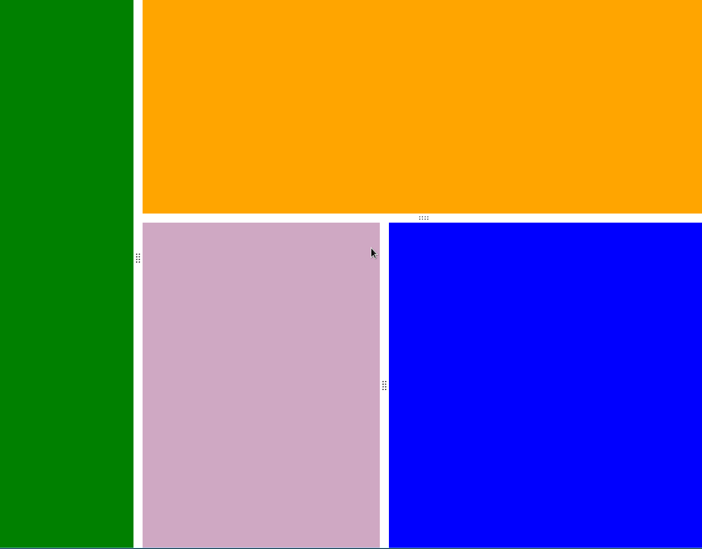
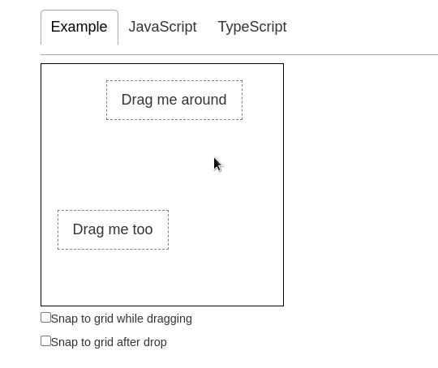

# react 结合 react-dnd 做的可拖拽 layout

gif 动图



# 如何使用

- 克隆项目 `git clone  https://github.com/ifnk/react-drag-layout-demo.git`
- yarn 安装  `yarn`
- yarn 启动  `yarn start `

# 一些说明

- 参考了官方的  [examples](https://react-dnd.github.io/react-dnd/examples/drag-around/custom-drag-layer)

  代码在 [github](https://github.com/react-dnd/react-dnd/tree/main/packages/examples/src/02-drag-around/custom-drag-layer)

  官方动图

  他加了一些 对齐到网格的功能 但是我不知道拖拽时怎么锁定轴约束

  

- drop 和 DndProvider backend={HTML5Backend} 不能一起用 不然报错
    ```error
    index.ts:28 Uncaught Invariant Violation: Expected drag drop context
        at invariant (http://localhost:4201/static/js/bundle.js:50947:15)
        at useDragDropManager (http://localhost:4201/static/js/bundle.js:54741:66)
        at useDropTargetMonitor (http://localhost:4201/static/js/bundle.js:54960:93)
        at useDrop (http://localhost:4201/static/js/bundle.js:54877:97)
        at App (http://localhost:4201/main.f4e5f42346eb59e0d43c.hot-update.js:48:70)
        at renderWithHooks (http://localhost:4201/static/js/bundle.js:25808:22)
        at mountIndeterminateComponent (http://localhost:4201/static/js/bundle.js:30384:17)
        at beginWork (http://localhost:4201/static/js/bundle.js:31842:20)
        at HTMLUnknownElement.callCallback (http://localhost:4201/static/js/bundle.js:13768:18)
        at Object.invokeGuardedCallbackDev (http://localhost:4201/static/js/bundle.js:13817:20)
    ```

- dragLayer 用来做拖拽时的影子(preview)
  
